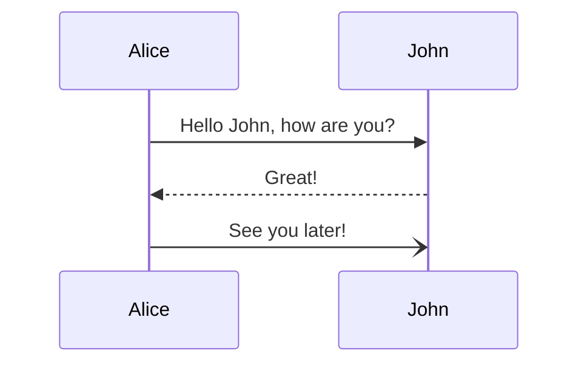

This is your new *vault*.

Make a note of something, [[create a link]], or try [the Importer](https://help.obsidian.md/Plugins/Importer)!

When you're ready, delete this note and make the vault your own.


ich hasse alles
wjdoa
dwjia


```python
def my_method(x : int) -> int:
	# mmm square
	return x**2
```

$$\int^{x}_0 \frac{1}{x+2} dx=\dots$$

![[img.jpg]]

[:c](https://de.wikipedia.org/wiki/Tirol_(Bundesland))

</img>